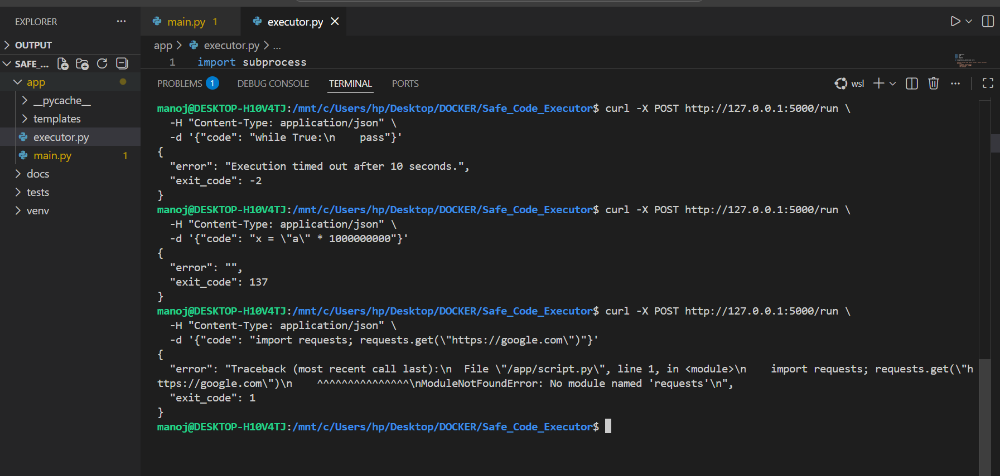
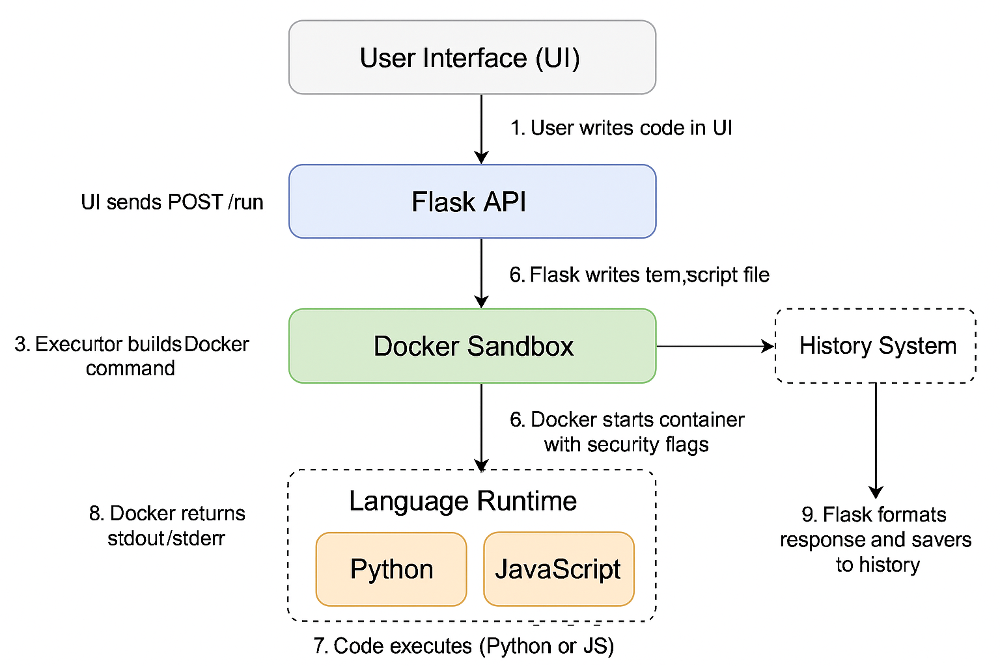
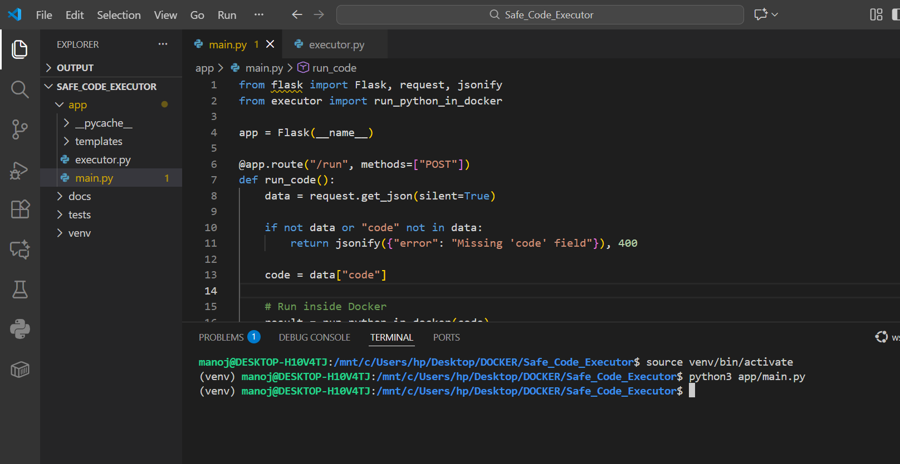
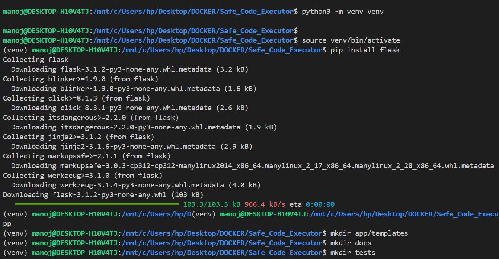

# Safe Code Executor

A secure Flask + Docker–based sandbox that runs **Python** and **JavaScript** code safely in isolated containers.

Safe Code Executor is a secure sandbox system that runs untrusted Python and JavaScript code inside isolated Docker containers.
It enforces strict security controls—timeout, memory limits, no network, and read-only filesystem—to ensure safe execution. Includes a simple web UI and execution history.

This guide shows **exactly how to run the project**, with **step-by-step instructions**, **command examples**, and **expected output** for every step.

---
app/outputs/all.png



##  Project Structure

```text
Safe_Code_Executor/
│
├── app/
│   ├── main.py              # Flask server (routes, validation, UI)
│   ├── executor.py          # Docker sandbox executor
│   ├── history.json         # Stores last 10 executions
│   └── templates/
│       └── index.html       # Web UI
│
├── docs/
│   └── SECURITY_NOTES.md    # Notes from Docker security experiments
│
├── requirements.txt         # Python dependencies
└── README.md                # Documentation
```

---

##  What Each Component Does

| Component             | Description                                                                      |
| --------------------- | -------------------------------------------------------------------------------- |
| **main.py**           | API `/run`, `/history`, `/ui`, validates input, saves history                    |
| **executor.py**       | Runs code safely inside Docker with limits (timeout, RAM, no network, read-only) |
| **index.html**        | UI (textarea + language selector + run button + output)                          |
| **history.json**      | Stores last 10 executions with timestamp                                         |
| **SECURITY_NOTES.md** | Results of sandbox experiments                                                   |

---

##  System Architecture (5 Layers)

### **1️.UI (User Interface)**

* HTML textarea for writing code
* Language selector
* Sends `{ language, code }` to backend
* Displays output / errors

### **2️.Flask API**

* Validates:

  * Supported languages (`python`, `javascript`)
  * Code length ≤ **5000 chars**
* Saves execution history
* Sends code to Docker executor

### **3️.Secure Docker Sandbox**

* Executes untrusted code with:

  * `--network none` → No internet
  * `--read-only` → No file writes
  * `--memory=128m` → RAM limit
  * Timeout 10 sec
* Images:

  * Python → `python:3.11-slim`
  * JavaScript → `node:18-slim`

### **4️.Executor Module**

* Writes code to temporary file
* Mounts as read-only inside container
* Captures stdout, stderr, exit code

### **5️.History System**

* Stores last 10 runs in `history.json`
* Accessible via `/history`




---

##  Execution Flow

1. User writes code in UI
2. Browser sends POST → `/run`
3. Flask validates code
4. Code is written to temp file
5. Executor selects container (Python/JS)
6. Docker runs with security restrictions
7. Output/error returned to Flask
8. Added to history
9. Shown in UI

---

#  Prerequisites

* Python 3.8+
* Docker Desktop
* WSL2 recommended
* Git

---

#  Getting Started (Step-by-Step)

---

## **1️ Clone the Project**

```bash
git clone <your_repo_url>
cd Safe_Code_Executor
```

**Expected Output**

```
Cloning into 'Safe_Code_Executor'...
```

---

## **2️ Create & Activate Virtual Environment**

```bash
python3 -m venv venv
source venv/bin/activate
```

**Expected**

```
(venv)
```

---

## **3️ Install Dependencies**

```bash
pip install -r requirements.txt
```

**Expected**

```
Successfully installed flask ...
```

---

## **4️ Start Docker Daemon**

Open **Docker Desktop** → Wait for "Docker is running".

Optional test:

```bash
docker run hello-world
```

---

## **5️ Run the Flask Server**

```bash
python3 app/main.py
```

---

#  API Testing (Step-by-Step)

---

## **6️ Health Check**

```bash
curl http://127.0.0.1:5000/
```

Expected:

```
Safe Code Executor API is running!
```

---

## **7️ Run Python Code**

```bash
curl -X POST http://127.0.0.1:5000/run \
 -H "Content-Type: application/json" \
 -d '{"language":"python","code":"print(2+2)"}'
```

Expected:

```json
{"output":"4\n"}
```

---

## **8️ Run JavaScript Code**

```bash
curl -X POST http://127.0.0.1:5000/run \
 -H "Content-Type: application/json" \
 -d '{"language":"javascript","code":"console.log(2+2)"}'
```

Expected:

```json
{"output":"4\n"}
```

---

#  Security Tests (With Expected Outputs)

---

## **9️ Infinite Loop (Timeout)**

```bash
curl -X POST http://127.0.0.1:5000/run \
  -H "Content-Type: application/json" \
  -d '{"language":"python","code":"while True: pass"}'
```

Expected:

```json
{"error":"Execution timed out after 10 seconds.","exit_code":-2}
```

---

## **10 Memory Limit Test**

```bash
curl -X POST http://127.0.0.1:5000/run \
  -H "Content-Type: application/json" \
  -d '{"language":"python","code":"x = \"a\" * 1000000000"}'
```

Expected:

```json
{"error":"","exit_code":137}
```

---

## **1️1️ Network Block**

```bash
curl -X POST http://127.0.0.1:5000/run \
  -H "Content-Type: application/json" \
  -d '{"language":"python","code":"import urllib.request; urllib.request.urlopen(\"https://google.com\")"}'
```

Expected: DNS/network failure (no internet inside container).

---

## **1️2️ Read-Only Filesystem**

```bash
curl -X POST http://127.0.0.1:5000/run \
 -H "Content-Type: application/json" \
 -d '{"language":"python","code":"open(\"/tmp/hack.txt\",\"w\").write(\"hello\")"}'
```

Expected:

```
OSError: [Errno 30] Read-only file system
```

---

## **1️3️ Code Length Limit**

Send >5000 characters.

Expected:

```json
{"error":"Code too long. Maximum allowed length is 5000 characters."}
```

---

#  Web UI

Open in browser:

```
http://127.0.0.1:5000/ui
```

Features:
 ```
 Textarea for code
 Language dropdown
 Run button
 Clear button
 Output console
```
---

#  Execution History

Get last 10 executions:

```bash
curl http://127.0.0.1:5000/history
```

---

# **10. Bonus Features Implemented**

#### **1. Node.js Execution (JavaScript Support)**

* Added support for executing JavaScript code using **Node.js**.
* `/run` endpoint now accepts:

  ```json
  { "language": "javascript", "code": "console.log(10+20)" }
  ```
* Uses `node:20-slim` Docker image.
* Runs code with:

  ```
  node /app/script.js
  ```
* Same security flags as Python (timeout, memory limit, no network, read-only FS).

---

#### **2. UI Improvements**

* Added **language selector** (Python / NodeJS).
* Cleaner UI styling for better readability.
* Output box redesigned.
* Added **History panel** (fetches data from `/history`).
* Added optional **“Run as Node”** behavior triggered by language selection.

---

#### **3. Syntax Highlighting**

* Integrated **Prism.js** for syntax-highlighted preview.
* Editor remains a `<textarea>` for simplicity.
* Output preview now visually grouped and styled.

---

#### **4. Execution History**

* Stores last **10 runs** in `history.json`.
* Each entry includes:

  * language
  * timestamp
  * truncated code (first 100 chars)
  * output
  * error
  * exit_code
* History visible in UI sidebar and via API:

  ```
  GET /history
  ```

---


#  Security Features Implemented

* Timeout (10 seconds)
* Memory limit (128MB)
* Network disabled (`--network none`)
* Read-only filesystem
* Mounted file read-only
* Code length limit (5000 chars)
* Isolated Docker container per run

---
# **11. Required Demonstration Tests**

---

## **Phase 1 — Normal Code Tests**

| Test                                  | Expected Result    |
| ------------------------------------- | ------------------ |
| `print("Hello")`                      | Prints “Hello”     |
| `x = 5 + 3; print(x)`                 | Prints `8`         |
| Loops (`for i in range(5): print(i)`) | Works normally     |
| JS: `console.log("Hello")`            | Works with Node.js |

---

## **Phase 2 — Security Tests**

### **1. Infinite Loop → Timeout**

```python
while True: pass
```

**Expected:**

```
Execution timed out after 10 seconds.
exit_code: -2
```

---

### **2. Memory Bomb → OOM Kill**

```python
x = "a" * 1000000000
```

**Expected:**

```
exit_code: 137   (killed due to memory limit)
```

---

### **3. Network Request → Blocked**

```python
import urllib.request
urllib.request.urlopen("https://google.com")
```

**Expected:**
Network failure. DNS resolution error. No internet allowed.

---

### **4. Write File → Blocked (Read-Only FS)**

```python
open("/tmp/hack.txt", "w").write("hello")
```

**Expected:**

```
OSError: [Errno 30] Read-only file system
```

---

### **5. Long Code (>5000 chars) → Rejected**

When sending more than 5000 characters of code:

**Expected:**

```json
{ "error": "Code too long. Maximum allowed length is 5000 characters." }
```

---

## **Phase 3 — Docker Security Experiments**

### **1. Read `/etc/passwd` (Allowed in container)**

```python
print(open("/etc/passwd").read())
```

**Expected:**
Container’s internal `/etc/passwd` is printed — safe.

---

### **2. Write Before `--read-only`**

Before enabling read-only, writing succeeded.
After enabling:

```python
open("/app/script.py", "w").write("hack")
```

**Expected:**

```
OSError: [Errno 30] Read-only file system
```

---

### **3. Verify Isolation**

* Container cannot access host files.
* Only sees container’s filesystem.

---


#  What I Learned

### **Docker Security**

* Container isolation
* Memory/CPU limits
* No-network execution
* Read-only root filesystems

### **Safe Code Execution Design**

* Prevent infinite loops
* Prevent memory abuse
* Prevent file writes
* Prevent network misuse

### **Backend Development**

* REST API design (`/run`, `/history`, `/ui`)
* JSON-based responses
* Error handling

### **Frontend Integration**

* HTML UI with textarea & live output
* Simple, practical developer tool

---


